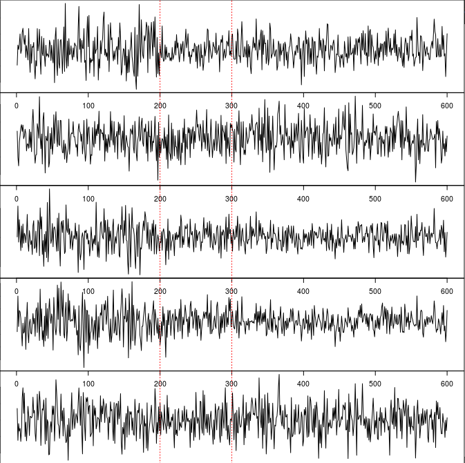
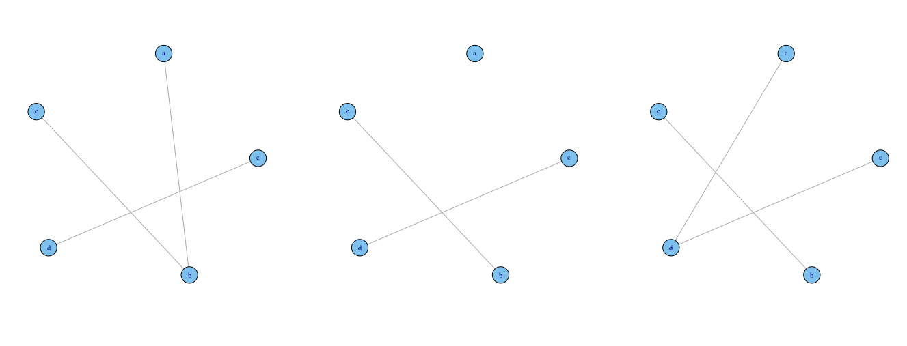

# Changepoints

[TOC "float:left"]

### 1. Level&Trend Change
An implementation of Page's mean shift detection algorithm.

**reference:**
[Changepoint Detection in Climate Time Series with Long-Term Trends](http://journals.ametsoc.org/doi/full/10.1175/JCLI-D-12-00704.1)

##### Raw data
Real change point positions: 1000,1700,2400,3100

##### Detected level and trend
Detected change point positions: 996,1695,2400,3104

### 2. Distrubution Change

### 3. Structural Change
An implementation of  Makram Talih's graph structural change detection algorithm.

**reference:**
[Structural learning with time‐varying components: tracking the cross‐section of financial time series](https://www.researchgate.net/publication/4914219_Structural_learning_with_time-varying_components_Tracking_the_crosssection_of_financial_time_series)

##### Raw data

##### Original gaussian graph

##### Detucted gaussian graph

### 4. Outlier

reference:

### 5. Online Changepoint Detection

Changepoints are abrupt variations in the generative parameters of a data sequence.

We compute the probability distribution of **the length of the current “run,”** or time since the last changepoint, using a simple message-passing algorithm.

Observations can be devided into non-overlapping paritions, data within each parition are i.i.d.

Exponential family likelihoods allow inference with a finite number of sufficient statistics which can be calculated incrementally as data arrives

### 6. Burst Detection
